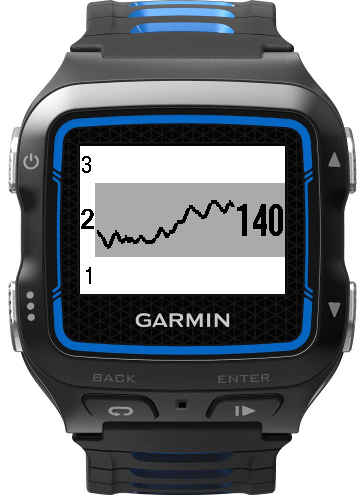
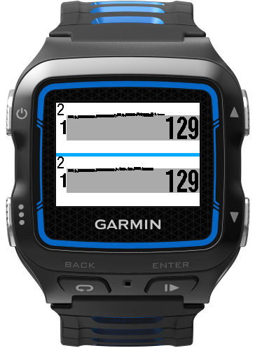

# 405HR
_Forerunner 405 styled HR graph - ConnectIQ Data Field for the Garmin Forerunner 920XT_

I missed the heart rate graph of the Forerunner 405 I had before, on the Forerunner 920XT.

The heart rate zone is indicated on the left, the current heart rate on the right.

The history size is 70 seconds.  
When full, the graph jumps 10 seconds to the left.

A threshold of 3 seconds avoids flip-flopping when your heart rate is around the zone limits.

## heart rate zones
Since the current ConnectIQ API version does not allow to retrieve the actual values,  
I simply hardcoded _my_ heart rate zones.

Zone 1: 60 - 129  
Zone 2: 130 - 144  
Zone 3: 145 - 159  
Zone 4: 160 - 169  
Zone 5: 170 - 185  

## Credits
I peeked at another chart implementation to get started:  
https://github.com/simonmacmullen/chart-datafields.git

## Source
The code can be found on GitHub:  
https://github.com/janverley/405HR/

## License
Licensed under http://www.wtfpl.net/
